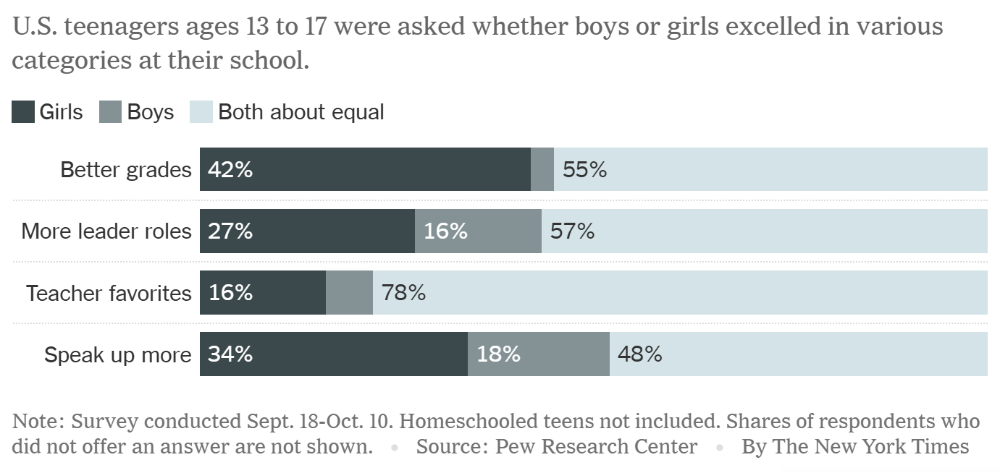
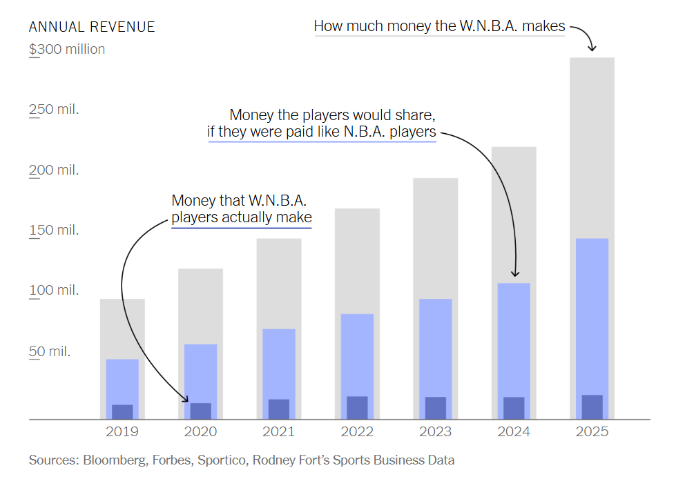
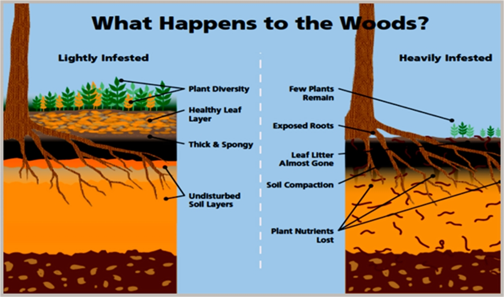
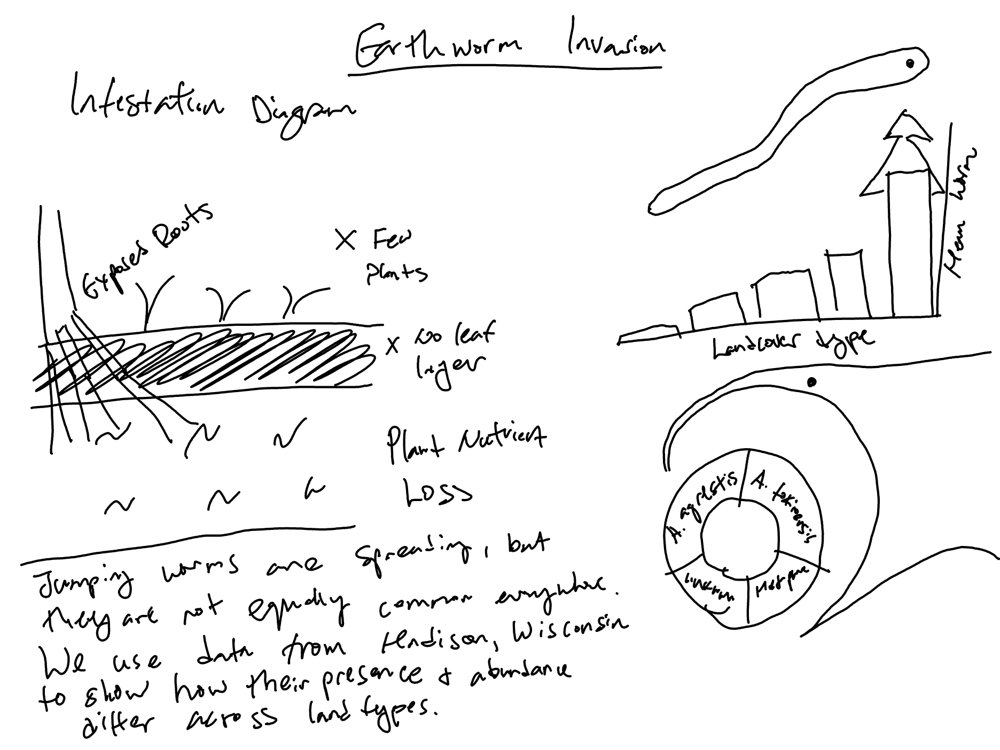

## Part III

1.  Restate the questions you hope to answer with your inforgraphic. This should include one overarching question (think of this as driving the overall theme of your infographic) and at least three sub-questions (each of which will be addressed by your infographic’s component visualizations). Have these questions changed at all since FPM #1? If yes, how so?

-   Overarching Question: How Does invasive jumping worm intensity vary across land cover types in Madison, Wisconsin?
    -   Sub-Question 1: How Common are jumping worms across sampled sites in Madison?
    -   Sub-Question 2: Which land cover type have the highest invasion intensity?
    -   Sub-Question 3: How do Jumping Worms and European Earthworms co-occur across different land cover types?
-   Yes, I have changed the dataset and came up with completely different set of questions.

2.  Explain which variables from your data set(s) you will use to answer the above questions, and how.

-   `jumping_worm_presence` to `jw_present`
-   `pour1_density`, `pour2_density`, `pour3_density` (combine to `mean_density_3pours`)
-   `landcover` to `landcover_type`
-   Summed and reshaped all `abundance_*`

3.  In FPM #2, you created some exploratory data viz to better understand your data. You may already have some ideas of how you plan to formally visualize your data, but it’s incredibly helpful to look at visualizations by other creators for inspiration. Find at least two data visualizations that you could (potentially) borrow / adapt pieces from. Download and embed them into your drafting-viz.qmd file, and explain which elements you might borrow (e.g. the graphic form, legend design, layout, etc.).

-   I like the New York Time's style visualization. The first example uses horizontal stacked bar charts to compare survey responses, which inspires how I might show worm presence categories across land cover types using clear color grouping and a simple legend. The second example uses annotations and highlighted bars to emphasize key insights in a time series, which inspires adding explanatory labels to draw attention to important patterns in my plots, such as landcovers with the highest jumping worm density. Together, these examples inform both the visual structure and storytelling approach for presenting my results clearly and effectively.
    -   [What’s Going On in This Graph? \| Girls Excel](https://www.nytimes.com/2025/10/23/learning/whats-going-on-in-this-graph-oct-29-2025.html?searchResultPosition=10)
    -   
    -   [What’s Going On in This Graph? \| Are W.N.B.A. players being compensated fairly?](https://www.nytimes.com/2026/02/05/learning/whats-going-on-in-this-graph-feb-11-2026.html?searchResultPosition=5)
    -   
-   I also looked at a conceptual infographic illustrating how forest ecosystems change from lightly infested to heavily infested by invasive earthworms. This visualization uses a side-by-side comparison layout to clearly show ecological differences between two conditions. I am inspired by its use of visual storytelling and progression, which allow the viewer to quickly understand how ecosystem conditions shift along an invasion gradient. In my infographic, I plan to borrow the idea of showing a clear contrast between lower and higher invasion intensity.
    -   [JUMPING WORMS](https://dnr.wisconsin.gov/topic/Invasives/fact/jumpingWorm)
    -   

## Part IV

-   

## Part V

```{r setup}
#| message: false
#| warning: false
#| eval: true
#| echo: false

# Packages
library(tidyverse)
library(here)
library(janitor)
library(waffle)
library(ggh4x)
library(sf)
library(tigris)
library(ggplot2)
```

```{r wrangle-worms}
#| message: false
#| warning: false

# --------------------------
# Load + Clean Data
# --------------------------

# Load data
worms_raw <- read_csv(here("data", "EDI_Data_Metadata_JumpingWorms.csv")) %>%
  clean_names()

# Clean data
worms <- worms_raw %>%
  mutate(site_id = as.character(site_id),
         landcover_type = str_to_title(landcover),
         
         # Fix inconsistent land cover labels
         landcover_type = recode(landcover_type,
                                 "Residential_lawn" = "Residential Lawn",
                                 "Residential_garden" = "Residential Garden"),


    # Jumping worm presence (YES/NO -> TRUE/FALSE)
    jw_present = case_when(
      jumping_worm_presence %in% c("YES", "Yes", "yes") ~ TRUE,
      jumping_worm_presence %in% c("NO",  "No",  "no")  ~ FALSE,
      TRUE ~ NA),

    # European worm presence across any of the 3 pours (YES/NO -> TRUE/FALSE)
    euro_present = case_when(
      pour1_european_earthworm_presence %in% c("YES","Yes","yes") |
        pour2_european_earthworm_presence %in% c("YES","Yes","yes") |
        pour3_european_earthworm_presence %in% c("YES","Yes","yes") ~ TRUE,
      pour1_european_earthworm_presence %in% c("NO","No","no") &
        pour2_european_earthworm_presence %in% c("NO","No","no") &
        pour3_european_earthworm_presence %in% c("NO","No","no") ~ FALSE,
      TRUE ~ NA),

    # Mean density across the three pours (invasion intensity metric)
    mean_density_3pours = rowMeans(cbind(pour1_density, 
                                         pour2_density, 
                                         pour3_density), 
                                   na.rm = TRUE),
    mean_density_3pours = if_else(is.nan(mean_density_3pours), 
                                  NA_real_, mean_density_3pours),

    # Total jumping worm abundance across species columns
    total_worm_count = rowSums(
      cbind(abundance_tok, abundance_agr, abundance_unk, abundance_mh),
      na.rm = TRUE))
```

```{r plot-1}
#| message: false
#| warning: false

# --------------------------
# Plot 1 — Mean density by Land Cover (low -> high)
# --------------------------

# Summarize mean jumping worm density per habitat, ordered low to high
density_by_landcover <- worms %>%
  filter(!is.na(mean_density_3pours), !is.na(landcover_type)) %>%
  group_by(landcover_type) %>%
  summarize(
    mean_density = mean(mean_density_3pours, na.rm = TRUE),
    n_sites = n(),
    .groups = "drop") %>%
  arrange(mean_density)

# Bar chart of mean density by habitat
p_density <- ggplot(
  density_by_landcover,
  aes(x = reorder(landcover_type, mean_density), y = mean_density)) +
  geom_col(fill = "#8B4513") +
  labs(title = "Jumping Worm Density Across Landcover Types", 
       x = "Landcover Type",
       y = "Mean Jumping Worm Density") +
  scale_x_discrete(labels = scales::label_wrap(12)) +
  theme_minimal(base_size = 12) +
  theme(plot.title = element_text(just = 0.5),
        axis.text.x = element_text(size = 10, hjust = 0.5),
        axis.title.x = element_text(margin = margin(t = 10)),
        axis.title.y = element_text(margin = margin(r = 10)),
        plot.margin = margin(t = 20, r = 20, b = 20, l = 40),
        panel.grid.major.x = element_blank(),
        panel.grid.minor.x = element_blank(),
        panel.grid.major.y = element_line(color = "grey80"))

p_density
```

```{r plot-2}
#| message: false
#| warning: false

# --------------------------
# Plot 2 — Donut chart: share of sites invaded (NA removed)
# --------------------------

# Calculate percentage of sites with jumping worms present vs. not
invasion_share <- worms %>%
  filter(!is.na(jw_present)) %>%
  count(jw_present) %>%
  mutate(pct = 100 * n / sum(n),
         site_status = if_else(jw_present, "Invaded", "Not invaded")) %>%
  select(site_status, n, pct)

# Donut chart showing invaded vs. not-invaded site proportions
p_invaded <- ggplot(invasion_share, aes(x = 2, y = pct, 
                                        fill = site_status)) +
  geom_col(color = "white") +
  coord_polar(theta = "y") +
  xlim(0.5, 2.5) +
  theme_void() +
  labs(fill = "Site Status",
       title = "Proportion of Sites Invaded by Jumping Worms") +
  theme(legend.position = "right",
        plot.title = element_text(size = 13, face = "bold",
                                  margin = margin(b = 4)),
        plot.margin = margin(t = 20, r = 20, b = 20, l = 40))

p_invaded
```

```{r plot-3A}
#| message: false
#| warning: false

# --------------------------
# Plot 3A — Stack Bar
# --------------------------

# Co-occurrence categories
coexistence <- worms %>%
  filter(!is.na(jw_present), !is.na(euro_present), !is.na(landcover_type)) %>%
  mutate(worm_status = 
           case_when(jw_present & euro_present ~ "Both present",
                     jw_present & !euro_present ~ "Jumping worms only",
                     !jw_present & euro_present ~ "European worms only",
                     TRUE ~ "Neither")) %>%
  count(landcover_type, worm_status) %>%
  group_by(landcover_type) %>%
  mutate(pct = 100 * n / sum(n)) %>%
  ungroup()

p_species <- ggplot(coexistence, aes(x = landcover_type, y = pct, 
                                     fill = worm_status)) +
  geom_col() +
  scale_x_discrete(labels = scales::label_wrap(12)) +
  labs(x = "Landcover Type",
       y = "Share of Sites (%)",
       fill = "Worm Presence") +
  theme_minimal(base_size = 12) +
  
  theme(plot.title = element_blank(),
        axis.text.x = element_text(size = 10, hjust = 0.5))

p_species
```

```{r plot-3B}
#| message: false
#| warning: false

# --------------------------
# Plot 3B — Waffle Bar
# --------------------------

# One row per site with worm status counts coded by habitat
sites <- bind_rows(
  tibble(landcover = "Forest", 
         status = c(rep("Both", 0), rep("JW only", 4), 
                    rep("Euro only", 6), rep("Neither", 6))),
  tibble(landcover = "Grassland", 
         status = c(rep("Both", 0), rep("JW only", 0), 
                    rep("Euro only", 7), rep("Neither", 9))),
  tibble(landcover = "Open Space",
         status = c(rep("Both", 2), rep("JW only", 0), 
                    rep("Euro only", 8), rep("Neither", 4))),
  tibble(landcover = "Residential Garden", 
         status = c(rep("Both", 3), rep("JW only", 15),
                    rep("Euro only", 12),rep("Neither", 9))),
  tibble(landcover = "Residential Lawn",
         status = c(rep("Both", 2), rep("JW only", 6), 
                    rep("Euro only", 8), rep("Neither", 23)))) %>%
  mutate(landcover = factor(landcover, # Set display order of habitats
                            levels = c("Forest",
                                       "Grassland",
                                       "Open Space",
                                       "Residential Garden",
                                       "Residential Lawn"))) %>%
  group_by(landcover) %>%
  mutate(col = (row_number() - 1) %% 16,  # Wrapping at 16 cols
         row = (row_number() - 1) %/% 16) %>%
  ungroup()

# Compute panel heights - tiles stay square across habitats with different row n
panel_heights <- sites %>%
  group_by(landcover) %>%
  summarise(nrows = max(row) + 1) %>%
  pull(nrows)

# Plot waffle chart with one facet per habitat, sized proportionally
ggplot(sites, aes(x = col, y = -row, fill = status)) +
  geom_tile(colour = "white", linewidth = 1.5, 
            width = 0.9, height = 0.9) +
  facet_wrap(~landcover, ncol = 1, 
             strip.position = "left", scales = "free_y") +
  force_panelsizes(rows = panel_heights) +
  scale_fill_manual(values = c(
    "Both"      = "#7B3294",
    "JW only"   = "#2E7D32",
    "Euro only" = "#F39C12",
    "Neither"   = "#E8E5E0")) +
  labs(title = "Where Are Invasive Jumping Worms Found?",
       subtitle = "Each Square Represents One Site, Unranked") +
  theme_void() +
  theme(plot.title = element_text(size = 13, face = "bold",
                                  margin = margin(b = 4)),
        plot.subtitle = element_text(size = 11,
                                     margin = margin(b = 20)),  
    strip.text.y.left = element_text(angle = 0, hjust = 1.0, 
                                     vjust = 0.5, size = 9,
                                     face = "bold", 
                                     margin = margin(r = 8)),
    legend.title      = element_blank(),
    legend.position   = "right",
    strip.placement = "outside",
    panel.spacing     = unit(0.3, "lines"),
    plot.margin = margin(t = 20, r = 20, b = 20, l = 40))
```

```{r plot-4}
#| message: false
#| warning: false

# --------------------------
# Plot 4 — Map
# --------------------------

# Get Wisconsin state and Madison city boundaries
options(tigris_use_cache = TRUE)
wisconsin <- states(cb = TRUE) %>% 
  filter(NAME == "Wisconsin")
madison <- places(state = "WI", cb = TRUE) %>% 
  filter(NAME == "Madison")

# Plot
ggplot() +
  geom_sf(data = wisconsin, fill = NA, 
          color = "#555555", linewidth = 0.8) +
  geom_sf(data = madison, fill = "#F0EDE8", 
          color = "#C0392B", linewidth = 0.6) +
  theme_void()

# Get Madison centroid for label placement
madison_centroid <- st_centroid(madison) %>% 
  st_coordinates()

# Add annotation for Madison
ggplot() +
  geom_sf(data = wisconsin, fill = NA, 
          color = "#555555", linewidth = 0.8) +
  geom_sf(data = madison,   fill = "#F0EDE8", 
          color = "#C0392B", linewidth = 0.6) +
 annotate("text",
           x = madison_centroid[1] + 0.6,
           y = madison_centroid[2] + 0.45,
           label = "Madison, WI\nStudy Sites",
           size = 3.5,
           color = "#333333",
           hjust = 0,
           family = "sans") +
  geom_curve(
    aes(x = madison_centroid[1] + 0.55,
        y = madison_centroid[2] + 0.35,
        xend = madison_centroid[1] + 0.05,
        yend = madison_centroid[2] + 0.05),
    curvature = -0.3, # controls bend
    arrow = arrow(length = unit(0.2, "cm"), type = "closed"),
    color = "#555555",
    linewidth = 1.1) +
  theme_void() +
  labs(title = "Study Site: Madison, Wisconsin")
```

## Part VI

1.  What are the key insights you want your infographic to communicate, and how will your design choices help highlight and support those messages?

    -   The infographic highlights how invasive jumping worms are distributed across different land c over types and how they interact with existing earthworm communities. The donut chart shows how common jumping worms are across sampled sites. The bar chart highlights differences in mean jumping worm density across land cover types, revealing where invasion intensity is highest. The stacked bar chart shows how jumping worms and European earthworms co-occur across land cover types, providing insight into patterns in the worm community. Simple chart types, consistent labels, and clear color groupings help make these comparisons easy to understand.

2.  What challenges did you encounter or anticipate encountering as you continue to build / iterate on your visualizations in R? If you struggled with mocking up any of your three visualizations, describe those challenges here.

    -   One challenge was aligning my research questions with the variables available in the dataset. For example, European earthworms were recorded as presence/absence rather than abundance, so I adjusted my analysis to examine co-occurrence patterns instead of abundance ratios. I tried different chart types before selecting simpler visualizations that clearly communicate the data.

3.  What ggplot extension tools / packages do you need to use to build your visualizations? Are there any that we haven’t covered in class that you’ll be learning how to use for your visualizations?

    -   My visualizations primarily use ggplot within the tidyverse, along with dplyr, tidyr, janitor, and here for data cleaning and organization. I may also use layout tools such as patchwork, Canva, or Affinity to combine the plots into a single infographic.

4.  What feedback do you need from the instructional team and / or your peers to ensure that your intended message and key insights are clear?

    -   I would appreciate feedback on whether my overarching question and sub-questions align to make one infographic, and whether the data types I am asking about are worth exploring. What techniques can I use to bind the narratives to the audience?
